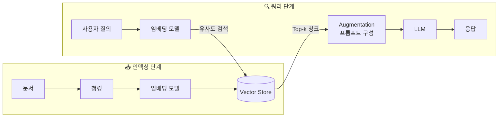
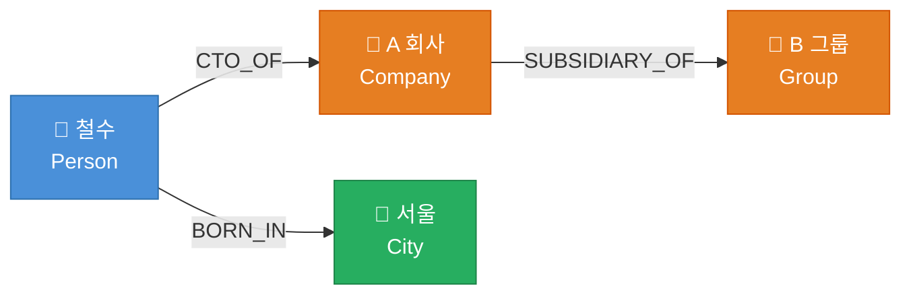
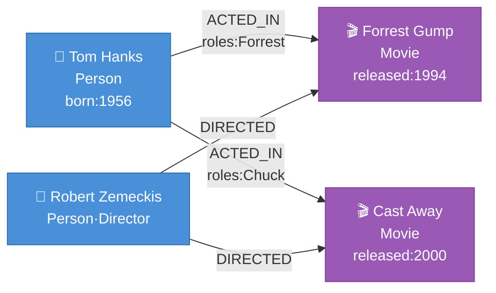

## Graph RAG Series

- [x] <span style="color: #07a8f7">[1] **Naive RAG의 한계와 Graph RAG의 필요성**</span>
- [ ] [2] Neo4j + LLM 연동과 Graph RAG 파이프라인 구현

---

## 1. Introduction

LLM<sup>Large Language Model</sup>은 방대한 지식을 내재화하고 있지만, 학습 이후의 최신 정보나 특정 도메인의 내부 문서는 알지 못한다. 이 한계를 극복하기 위해 등장한 것이 **RAG<sup>Retrieval-Augmented Generation</sup>**이다.

RAG는 크게 두 단계로 나뉜다. 바로 **인덱싱<sup>Indexing</sup>** 단계와 **쿼리<sup>Query</sup>** 단계다.


_RAG 전체 파이프라인: 인덱싱(좌)과 쿼리(우) 두 단계로 구성된다_

### Retrieve 단계

외부 문서를 **검색 가능한 형태**로 준비하고, 쿼리와 가장 유사한 내용을 불러오는 단계다.

1. **청킹<sup>Chunking</sup>**: 긴 문서를 일정 크기의 `청크`로 분할
2. **임베딩<sup>Embedding</sup>**: 각 청크를 고차원 수치 벡터로 변환 (예: `text-embedding-3-small`)
3. **인덱싱**: 변환된 벡터를 `Vector Store`(예: Chroma, Pinecone, FAISS)에 저장
4. **검색**: 쿼리를 임베딩하거나 파싱하여, 유사도·키워드 등 다양한 기준으로 Top-k 청크 반환

검색 방식은 크게 세 가지로 나뉜다. `BM25` 같은 **키워드 기반** 방식, 벡터 간 코사인 유사도를 활용하는 **시맨틱<sup>Semantic</sup> 기반** 방식, 그리고 두 방식을 결합한 **하이브리드<sup>Hybrid</sup>** 방식이다. 어떤 전략을 쓸지는 용도에 따라 달라지며, 이 역할을 담당하는 컴포넌트가 `Retriever`다.

### Augment 단계

검색된 청크들을 LLM에 전달하기 위한 **컨텍스트 조립** 단계다.

1. **컨텍스트 구성**: Top-k 청크를 하나의 컨텍스트 문자열로 결합
2. **프롬프트 주입**: 시스템 프롬프트 + 컨텍스트 + 사용자 질의를 함께 구성
3. **LLM 호출**: 보강된 프롬프트를 LLM에 전달하여 응답 생성

**핵심 컴포넌트**

| 컴포넌트 | 역할 |
|---|---|
| `Embedder` | 문서와 쿼리를 고차원 벡터로 변환 |
| `Vector Store` | 벡터화된 청크를 저장하고 인덱싱 |
| `Retriever` | 검색 전략(키워드·시맨틱·하이브리드)을 실행하여 Top-k 청크 반환 |
| `LLM` | 검색된 컨텍스트를 기반으로 응답 생성 |

단순하고 직관적인 구조지만, 조금 복잡한 질문에는 금방 한계가 드러난다.

---

## 2. Naive RAG의 한계

여기서 다루는 **Naive RAG**는 문서 청킹 → 임베딩 → 검색 → LLM 응답이라는 가장 기본적인 파이프라인을 의미하며, 이후 등장한 변형들과 구분하기 위한 용어다.

이후 연구들은 Naive RAG의 한계를 보완하는 방향으로 발전한다. **Advanced RAG**는 `Query Rewriting`, `Re-ranking`, 하이브리드 검색 같은 기법을 추가하여 검색 품질을 높인 방식이고, **Modular RAG**는 각 컴포넌트를 독립 모듈로 분리해 자유롭게 조합·교체할 수 있도록 프레임워크화한 방식이다. 이 글에서는 그 출발점인 Naive RAG의 구조적 한계에 집중한다.

### 청크 기반 검색의 문맥 단절

Naive RAG는 문서를 일정 크기의 `청크`로 분할해 벡터로 저장한다. 문제는 이 과정에서 **문서 내의 관계와 흐름이 끊긴다**는 것이다.

예를 들어, 다음과 같은 두 문장이 서로 다른 청크에 위치한다면:

- "철수는 A 회사의 CTO이다."
- "A 회사는 B 그룹의 계열사이다."

"철수가 속한 그룹은?"이라는 질문에 답하려면 두 청크를 연결해야 하지만, 벡터 유사도 검색만으로는 이 연결을 자동으로 찾아내기 어렵다.

### Multi-hop Reasoning 불가

위 예시처럼, **여러 단계를 거쳐야 답에 도달하는 추론**을 `Multi-hop Reasoning`이라고 한다. Naive RAG는 단일 검색 스텝 구조이므로, 정보를 연쇄적으로 추적하는 능력이 근본적으로 제한된다.

> Naive RAG는 "이 문서가 쿼리와 비슷한가?"는 잘 판단하지만, "이 문서들이 서로 어떻게 연결되는가?"는 알지 못한다.
{: .prompt-warning}

### 구조적 관계 표현 부재

"A는 B의 상위 개념이다", "X는 Y에 의존한다", "P는 Q를 창립했다"와 같은 **명시적 관계 정보**는 텍스트 임베딩에 부분적으로만 담긴다. 유사도 공간에서 이러한 방향성 있는 관계를 정확하게 표현하기 어렵다.

### 유사도 기반 검색의 노이즈

Top-k 유사도 검색은 정답과 무관한 청크도 함께 반환할 수 있다. 청크가 표면적으로 유사하더라도 **의미론적으로 관련 없는 내용**이 컨텍스트에 포함되면 LLM의 응답 품질이 저하된다.

---

## 3. Graph RAG가 필요한 이유

앞서 살펴본 한계들은 결국 같은 지점을 가리킨다. Naive RAG는 텍스트를 잘게 쪼개 저장하면서, 그 사이에 존재하는 **관계<sup>Relationship</sup>를 버린다**.

### Naive RAG의 한계를 정식화한 연구

Microsoft Research의 Edge et al. (2024)는 논문 "From Local to Global: A Graph RAG Approach to Query-Focused Summarization"에서 이 문제를 정식화하였다.

논문은 RAG 질의를 두 종류로 분류한다.

| 질의 유형 | 예시 | Naive RAG 성능 |
|---|---|---|
| **로컬<sup>Local</sup> 질의** | "X의 생년월일은?" | 양호 (특정 사실 검색) |
| **글로벌<sup>Global</sup> 질의** | "이 문서 전체의 주요 주제는?" | 부족 (전체 이해 필요) |

Naive RAG는 특정 사실을 찾는 로컬 질의에는 효과적이지만, **전체 코퍼스<sup>Corpus</sup>를 이해해야 하는 글로벌 질의**에는 구조적으로 취약하다. 논문에서 제안한 해결 방법은 다음과 같다.

1. **그래프 구성**: LLM을 사용하여 문서에서 엔티티<sup>Entity</sup>와 관계를 추출, `Knowledge Graph` 구축
2. **커뮤니티 탐지<sup>Community Detection</sup>**: `Leiden 알고리즘`으로 그래프를 커뮤니티(연결이 밀집된 노드 집합)로 분할
3. **커뮤니티 요약**: LLM이 각 커뮤니티에 대한 요약문 생성
4. **계층적 검색**: 커뮤니티 요약 기반 글로벌 검색 + 엔티티 이웃 탐색을 통한 로컬 검색

> 실험 결과 Graph RAG는 글로벌 질의에서 Naive RAG 대비 **포괄성<sup>Comprehensiveness</sup>**과 **다양성<sup>Diversity</sup>** 지표 모두에서 유의미하게 높은 성능을 보였다.
{: .prompt-tip}

### Naive RAG vs Graph RAG

**Graph RAG**는 문서에서 추출한 엔티티와 관계를 `Knowledge Graph`로 구성하고, 이를 검색과 추론의 기반으로 활용한다.

| | Naive RAG | Graph RAG |
|---|---|---|
| 저장 단위 | 텍스트 청크 | 엔티티 + 관계 |
| 검색 방식 | 벡터 유사도 | 그래프 탐색 + 유사도 |
| Multi-hop | 불가 | 관계 경로 탐색으로 가능 |
| 관계 표현 | 암묵적 | 명시적 |
| 글로벌 이해 | 취약 | 커뮤니티 요약으로 지원 |

> Graph RAG는 Naive RAG를 대체하는 것이 아니라 **그래프 구조를 더하여 확장**하는 접근이다.
{: .prompt-tip}

이 구조를 이해하려면 먼저 `Knowledge Graph`가 무엇인지, 그리고 이를 저장하는 **Graph Database**가 어떻게 동작하는지 알아야 한다.

---

## 4. Knowledge Graph

### 정의

`Knowledge Graph`는 실세계의 엔티티<sup>Entity</sup>와 그 사이의 관계를 **노드<sup>Node</sup>와 엣지<sup>Edge</sup>**로 표현한 구조화된 지식 표현 방식이다.

앞서 든 예시를 그래프로 표현하면 다음과 같다.


_Knowledge Graph 예시: 노드(엔티티)와 방향이 있는 관계(엣지)로 구성된다. 타입별로 색을 달리하여 표현한다_

"철수가 속한 그룹은?"이라는 Multi-hop 질의는 이제 그래프를 두 단계 탐색(`철수 → A 회사 → B 그룹`)하는 것만으로 해결된다.

### 구성 요소

| 구성 요소 | 설명 | 예시 |
|---|---|---|
| `Node` | 엔티티<sup>Entity</sup> — 그래프의 개체 | 사람, 회사, 영화 |
| `Relationship` | 노드 간의 방향성 있는 연결 | CTO_OF, ACTED_IN |
| `Property` | 노드/관계의 속성 (`key: value` 쌍) | name: "철수", year: 2020 |
| `Label` | 노드의 타입 분류 | Person, Company |

### 관계형 DB vs 그래프 DB

관계형 데이터베이스<sup>RDBMS</sup>도 테이블 간 `JOIN`으로 관계를 표현할 수 있다. 그러나 관계의 깊이가 깊어질수록 `JOIN` 연산이 폭발적으로 증가하며 성능이 급격히 저하된다.

그래프 DB는 관계를 데이터 구조 자체에 내재화<sup>Index-free Adjacency</sup>하므로, **관계 탐색이 깊어져도 성능이 일정**하게 유지된다.

| 관점 | RDBMS | Graph DB |
|---|---|---|
| 관계 표현 | 외래키 + JOIN | `Relationship` 직접 저장 |
| 탐색 성능 | JOIN 깊이에 비례해 하락 | 관계 깊이에 무관 |
| 스키마 유연성 | 고정 스키마 | 유연한 속성 추가 |
| 직관성 | 테이블 중심 | 관계 중심 |

### 활용 사례

- **Google Knowledge Graph**: 검색 결과 사이드 패널의 엔티티 정보
- **의료 도메인**: 질병-증상-약물 간 관계 모델링
- **추천 시스템**: 사용자-아이템-태그 간 연결로 협업 필터링 강화
- **사이버 보안**: 공격 패턴, IP, 취약점 간 관계 추적

---

## 5. Graph Database - Neo4j

### Neo4j 소개

**Neo4j**는 세계에서 가장 널리 사용되는 네이티브 그래프 데이터베이스로, `Property Graph Model`을 기반으로 한다. 오픈소스 Community Edition과 엔터프라이즈 Edition을 제공하며, `Cypher`라는 전용 쿼리 언어를 사용한다.

### Property Graph Model

Neo4j의 데이터 모델은 4가지 핵심 요소로 구성된다.

**`Node` (노드)**

그래프의 개체<sup>Entity</sup>를 나타낸다. 괄호로 표기하며, 하나 이상의 레이블<sup>Label</sup>과 속성<sup>Property</sup>을 가질 수 있다.

```cypher
(tom:Person {name: "Tom Hanks", born: 1956})
```

**`Label` (레이블)**

노드의 타입을 분류한다. 하나의 노드가 여러 레이블을 동시에 가질 수 있다.

```cypher
(:Person)
(:Movie)
(:Person:Director)   -- 복수 레이블: Person이면서 Director
```

**`Relationship` (관계)**

두 노드를 연결하는 방향성 있는 링크다. 반드시 하나의 타입을 가지며, 속성을 포함할 수 있다.

```cypher
(tom)-[:ACTED_IN {roles: ["Forrest"]}]->(movie)
```

**`Property` (속성)**

노드와 관계 모두 `key: value` 형태의 속성을 가질 수 있다. 값은 문자열, 정수, 부동소수점, 불리언, 날짜, 리스트 등 다양한 타입을 지원한다.

```cypher
(:Person {name: "Tom Hanks", born: 1956, active: true})
(:Movie {title: "Forrest Gump", released: 1994, tagline: "Life is like a box of chocolates"})
-[:ACTED_IN {roles: ["Forrest", "Lt. Dan"]}]->
```

아래는 영화-배우 도메인을 Property Graph Model로 표현한 예시다.


_Neo4j Property Graph Model — 영화-배우 도메인. `Person` 노드(파랑)와 `Movie` 노드(보라)가 `ACTED_IN`, `DIRECTED` 관계로 연결된다_

### 인덱스와 제약 조건

**인덱스<sup>Index</sup>**는 특정 속성을 기반으로 노드를 빠르게 조회하기 위해 사용된다.

```cypher
-- Person 노드의 name 속성에 인덱스 생성
CREATE INDEX person_name FOR (p:Person) ON (p.name)
```

**제약 조건<sup>Constraint</sup>**은 데이터 무결성을 보장한다. 가장 흔하게 사용되는 것은 `UNIQUE` 제약이다.

```cypher
-- Movie 노드의 title은 유일해야 함
CREATE CONSTRAINT movie_title_unique
FOR (m:Movie) REQUIRE m.title IS UNIQUE
```

인덱스와 제약 조건을 적절히 설정하면, 대규모 그래프에서도 `MATCH` 쿼리의 시작 노드를 O(1)에 가깝게 찾을 수 있다.

### 그 외 주요 특징

완전한 `ACID` 트랜잭션을 지원하여 지식 그래프를 업데이트할 때 데이터 일관성이 보장되고, 유연한 스키마 덕분에 새로운 엔티티·관계 타입을 언제든 추가할 수 있다. `Index-free Adjacency` 구조로 관계 탐색이 깊어져도 성능이 일정하게 유지된다.

Graph RAG 개발 관점에서는 **LangChain 통합** (`Neo4jGraph`, `GraphCypherQAChain`), 공식 **Python 드라이버** (`pip install neo4j`), 로컬 설치 없이 시작할 수 있는 **Neo4j AuraDB** 등으로 빠르게 환경을 구성할 수 있다.

---

## 6. Cypher Query Language

### Cypher란?

**Cypher**는 Neo4j의 선언형<sup>Declarative</sup> 그래프 쿼리 언어다. SQL이 테이블을 대상으로 하듯, Cypher는 **그래프 패턴**을 시각적으로 표현하여 질의한다.

> Cypher의 핵심은 "ASCII Art"처럼 관계를 직접 그려서 쿼리한다는 점이다.  
> `(node1)-[:RELATIONSHIP]->(node2)` — 이 표현 자체가 쿼리의 패턴이다.
{: .prompt-info}

### 기본 문법

**노드 표현**

```cypher
()                               -- 익명 노드
(n)                              -- 변수 n으로 참조
(:Person)                        -- Person 레이블을 가진 노드
(p:Person {name: "Tom Hanks"})   -- 레이블 + 속성 필터
(p:Person:Director)              -- 복수 레이블
```

**관계 표현**

```cypher
-[:ACTED_IN]->                           -- 방향 있는 관계
-[:ACTED_IN]-                            -- 방향 무관
-[:ACTED_IN {roles: ["Forrest"]}]->      -- 관계 속성 포함
-[:KNOWS*1..3]->                         -- 1~3단계 가변 길이 관계
-[*]->                                   -- 모든 깊이 탐색
```

> **가변 길이 관계<sup>Variable-length Path</sup>** `[:KNOWS*1..3]`은 1단계에서 3단계까지의 모든 `KNOWS` 관계 경로를 탐색한다. SNS에서 "3촌 이내 지인" 조회, 조직도에서 "직속 상위 3단계 관리자" 탐색 같은 질의에 유용하다.
{: .prompt-tip}

### 핵심 쿼리

**`MATCH` + `RETURN`: 데이터 조회**

영화 "Forrest Gump"에 출연한 배우를 모두 조회한다.

```cypher
MATCH (p:Person)-[:ACTED_IN]->(m:Movie {title: "Forrest Gump"})
RETURN p.name AS actor, m.released AS year
```

**`WHERE`: 조건 필터링**

1990년대에 개봉한 Tom Hanks 출연 영화를 조회한다.

```cypher
MATCH (p:Person {name: "Tom Hanks"})-[:ACTED_IN]->(m:Movie)
WHERE m.released >= 1990 AND m.released < 2000
RETURN m.title, m.released
ORDER BY m.released
```

**`CREATE`: 노드와 관계 생성**

새로운 노드와 관계를 생성한다. `CREATE`는 항상 새로운 요소를 생성하므로 중복에 주의해야 한다.

```cypher
CREATE (p:Person {name: "이민석", born: 2000})
CREATE (m:Movie {title: "그래프의 세계", released: 2026})
CREATE (p)-[:DIRECTED]->(m)
```

**`MERGE`: 없으면 생성, 있으면 매칭**

`MERGE`는 해당 패턴이 존재하면 매칭하고, 없으면 새로 생성한다. `ON CREATE`와 `ON MATCH`로 각 경우의 추가 동작을 지정할 수 있다.

```cypher
MERGE (p:Person {name: "Tom Hanks"})
ON CREATE SET p.born = 1956, p.createdAt = datetime()
ON MATCH  SET p.lastSeen = date()
RETURN p
```

`ON CREATE`는 패턴이 새로 생성될 때만 실행되고, `ON MATCH`는 이미 존재하는 패턴과 매칭될 때만 실행된다. 두 절을 함께 쓰면 삽입과 업데이트 로직을 하나의 쿼리로 처리할 수 있다.

**`SET` / `DETACH DELETE`: 수정과 삭제**

```cypher
-- 속성 업데이트
MATCH (p:Person {name: "Tom Hanks"})
SET p.nationality = "American"
RETURN p

-- 노드 삭제 (연결된 모든 관계도 함께 삭제)
MATCH (p:Person {name: "임시노드"})
DETACH DELETE p
```

> `DELETE`는 관계가 없는 노드만 삭제할 수 있다. 관계가 있는 노드를 삭제할 때는 반드시 `DETACH DELETE`를 사용해야 한다.
{: .prompt-warning}

**`WITH`: 중간 결과 파이프라인**

`WITH`는 쿼리 중간에 결과를 필터링하거나 집계할 때 사용한다. SQL의 서브쿼리와 유사한 역할을 한다.

```cypher
-- 출연 영화가 3편 이상인 배우만 조회
MATCH (p:Person)-[:ACTED_IN]->(m:Movie)
WITH p, COUNT(m) AS movieCount
WHERE movieCount >= 3
RETURN p.name, movieCount
ORDER BY movieCount DESC
```

`MATCH`로 패턴을 수집한 뒤, `WITH`로 배우별 출연 편수를 집계하고, `WHERE`로 3편 미만을 제외한다. `WITH` 이후에는 앞에서 선언한 변수만 이어서 사용할 수 있다.

**`OPTIONAL MATCH`: 선택적 패턴 매칭**

`OPTIONAL MATCH`는 SQL의 `LEFT JOIN`과 유사하다. 매칭되는 패턴이 없어도 해당 노드를 제외하지 않고 `null`로 반환한다.

```cypher
-- 감독 정보가 없는 영화도 포함하여 조회
MATCH (m:Movie)
OPTIONAL MATCH (d:Person)-[:DIRECTED]->(m)
RETURN m.title, d.name AS director
```

**집계 함수<sup>Aggregation</sup>**

```cypher
MATCH (p:Person)-[:ACTED_IN]->(m:Movie)
RETURN
    p.name            AS actor,
    COUNT(m)          AS totalMovies,
    AVG(m.released)   AS avgYear,
    MIN(m.released)   AS firstMovie,
    MAX(m.released)   AS lastMovie,
    COLLECT(m.title)  AS movieTitles   -- 값을 리스트로 수집
ORDER BY totalMovies DESC
LIMIT 5
```

**문자열 함수**

```cypher
MATCH (m:Movie)
WHERE toLower(m.title) CONTAINS "forest"
   OR m.title STARTS WITH "Cast"
   OR m.title ENDS WITH "Away"
RETURN m.title, size(m.title) AS titleLength
```

### 실전 예제: 영화-배우 그래프 탐색

**2단계 관계 탐색 (Multi-hop)**

Tom Hanks와 함께 출연한 적이 있는 배우들이 Tom Hanks 없이 출연한 다른 영화를 추천한다.

```cypher
MATCH (tom:Person {name: "Tom Hanks"})-[:ACTED_IN]->(m:Movie)
      <-[:ACTED_IN]-(coActor:Person)-[:ACTED_IN]->(otherMovie:Movie)
WHERE NOT (tom)-[:ACTED_IN]->(otherMovie)
RETURN DISTINCT otherMovie.title AS recommendation, coActor.name AS via
LIMIT 10
```

이 쿼리를 단계별로 해석하면 다음과 같다.

1. `(tom:Person {name: "Tom Hanks"})-[:ACTED_IN]->(m:Movie)` — Tom Hanks가 출연한 모든 영화 `m`을 찾는다.
2. `<-[:ACTED_IN]-(coActor:Person)` — 같은 영화 `m`에 함께 출연한 다른 배우 `coActor`를 찾는다. 화살표 방향이 반대임에 주목한다.
3. `-[:ACTED_IN]->(otherMovie:Movie)` — 해당 `coActor`가 출연한 또 다른 영화 `otherMovie`를 찾는다.
4. `WHERE NOT (tom)-[:ACTED_IN]->(otherMovie)` — Tom Hanks가 이미 출연한 영화는 제외한다.
5. `RETURN DISTINCT` — 동일한 `otherMovie`가 여러 경로로 도달될 수 있으므로 중복을 제거하고, 추천 영화와 경유 배우를 함께 반환한다.

단순한 키워드 검색이나 벡터 유사도로는 불가능한 **2단계 관계 탐색**을 단 한 번의 쿼리로 처리한다. Graph RAG에서 이 구조는 "Tom Hanks와 연관된 영화 생태계"를 LLM의 컨텍스트로 주입하는 핵심 메커니즘이 된다.

---

## 7. 마무리

한 줄로 정리하면, "Naive RAG는 텍스트를 잘라 저장하고, Graph RAG는 그 사이의 관계까지 저장한다"이다.

| 주제 | 핵심 내용 |
|---|---|
| Naive RAG의 한계 | 청크 단절, Multi-hop 불가, 관계 표현 부재 |
| Graph RAG의 필요성 | 관계 보존, 구조적 탐색, 글로벌 질의 지원 (Edge et al., 2024) |
| Knowledge Graph | 엔티티 + 관계로 구성된 구조화된 지식 표현 |
| Neo4j | Property Graph Model 기반 네이티브 그래프 DB |
| Cypher | 패턴 매칭 기반 선언형 그래프 쿼리 언어 |

다음 포스팅에서는 Neo4j와 LangChain을 연동하여 **실제 Graph RAG 파이프라인을 구현**하는 방법을 다룰 예정이다. 문서에서 엔티티와 관계를 추출하고, Neo4j에 저장한 뒤, Cypher 쿼리로 검색하는 전체 흐름을 코드와 함께 살펴본다.

---

## References

- [Neo4j Fundamentals](https://graphacademy.neo4j.com/courses/neo4j-fundamentals/)
- [Cypher Fundamentals](https://graphacademy.neo4j.com/courses/cypher-fundamentals/)
- Edge et al., [From Local to Global: A Graph RAG Approach to Query-Focused Summarization](https://arxiv.org/abs/2404.16130) (2024)
- [Neo4j Documentation](https://neo4j.com/docs/)
